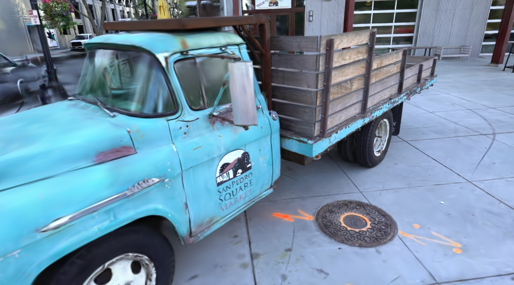

# 3D Gaussian Splatting Reproduction (个人复现)

这是我对 3D Gaussian Splatting 官方论文代码的个人复现记录。

## Result
这是使用官方提供的 Truck 数据集训练 9600 次迭代后的渲染效果：

## Environment
- **系统:** Windows 11
- **显卡:** NVIDIA RTX 3070ti Laptop
- **CUDA 版本:** 11.7

本项目基于官方开源代码进行复现：
[graphdeco-inria/gaussian-splatting](https://github.com/graphdeco-inria/gaussian-splatting)

环境配置参考如下教程：

https://blog.csdn.net/qq_35853567/article/details/151895582